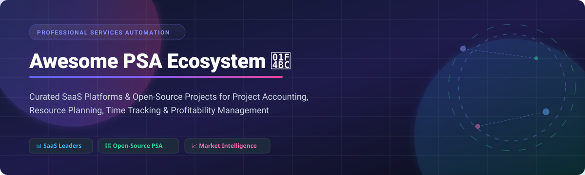

# 💼 Professional Services Automation (PSA) Ecosystem 🚀

     

---

## 📌 Executive Summary & Meta Description
A **curated collection of top Professional Services Automation (PSA) platforms**, open-source PSA GitHub repositories, project accounting systems, resource management tools, and service delivery solutions. Designed specifically for consulting firms, IT managed service providers (MSPs), digital agencies, engineering firms, and enterprise service organizations seeking to optimize resource utilization, streamline time tracking, and maximize project profitability.

---

## 📑 Table of Contents
- [📊 Market Overview & Industry Dynamics](#-market-overview--industry-dynamics)
- [🏢 SaaS & Cloud PSA Platforms](#-saas--cloud-psa-platforms)
- [🚀 Open-Source GitHub Projects](#-open-source-github-projects)
- [🛠️ Key Features of Modern PSA Software](#%EF%B8%8F-key-features-of-modern-psa-software)
- [🤝 How to Contribute](#-how-to-contribute)
- [⚠️ Disclaimer](#%EF%B8%8F-disclaimer)
- [💖 Support & Sponsorship](#-support--sponsorship)
- [⭐ Star History](#-star-history)

---

## 📊 Market Overview & Industry Dynamics

> 📈 **Market Size & Structure**: The global **Professional Services Automation (PSA)** software market was valued at **~$1.4 Billion to $1.6 Billion in 2024** and is projected to expand to **~$3.4 Billion by 2032** (growing at a compound annual growth rate of **~11.2%**). The sector is **moderately fragmented**, dominated by enterprise heavyweights (Microsoft, Oracle NetSuite, Adobe) for multi-billion dollar firms, alongside specialized SaaS platforms (Scoro, BigTime, Kantata) and high-growth open-source options (Odoo, ERPNext, Alga PSA).

---

## 🏢 SaaS & Cloud PSA Platforms

*SaaS platforms organized in descending order by **Company Valuation / Market Cap / Revenue**.*

| 🏢 Platform | 📝 Key Highlights & Description | 💰 Starting Price | 🎁 Free Tier / Trial Limit | 📊 Company Size / Valuation / Revenue |
| :--- | :--- | :--- | :--- | :--- |
| **[Microsoft Dynamics 365 Project Operations](https://dynamics.microsoft.com/en-us/project-operations/)** | Enterprise PSA connecting project sales, resourcing, delivery, and accounting with deep Microsoft 365 & Power Platform integration. | **$135** / user / month | **30-day free trial** (Requires M335 admin tenant) | **$3.1 Trillion** Market Cap (~$245B Revenue) |
| **[NetSuite OpenAir (SuiteProjects Pro)](https://www.netsuite.com/portal/products/openair.shtml)** | Oracle NetSuite's flagship PSA suite featuring advanced revenue recognition, billing, and global resource management. | **$399** base / mo + **$49** / user / mo | **No self-serve trial** (30-day sandbox via guided demo) | **$420 Billion** Market Cap (~$53B Revenue) |
| **[Workfront](https://www.workfront.com/)** | Adobe's enterprise work and portfolio management platform offering capacity planning, automated proofing, and project tracking. | **$30** / user / month *(Select Tier estimate)* | **No public trial** (30-day sales-assisted Test Drive) | **$220 Billion** Market Cap (~$19.4B Revenue) |
| **[Planview](https://www.planview.com/)** | Enterprise strategic portfolio and resource management suite tailored for multi-team work and capacity planning. | **$19** / user / month *(AgilePlace Tier)* | **30-day free trial** (ProjectPlace / AgilePlace, no credit card) | **$1.6 Billion** Valuation (~$400M Revenue) |
| **[BigTime](https://www.bigtime.net/)** | Time tracking, project accounting, and invoicing platform built for mid-sized consultancies and engineering firms. | **$10** / user / month *(Essentials Plan)* | **14-day free trial** (Full feature access with sample data) | **$350 Million** Valuation (~$50M ARR) |
| **[FinancialForce PSA (Certinia)](https://www.financialforce.com/)** | Built natively on the Salesforce platform, delivering end-to-end visibility from CRM opportunity to project revenue recognition. | **$45** / user / month *(AppExchange base tier)* | **No public trial** (Salesforce Org demo environment) | **~$200 Million** Revenue (PE-Backed) |
| **[Kantata (Mavenlink)](https://www.kantata.com/)** | Purpose-built PSA for professional services combining project management, resource allocation, and real-time operational analytics. | **$45** / user / month *(Base tier estimate)* | **No self-serve trial** (Guided 14-day demo upon request) | **~$150 Million** Revenue (PE-Backed) |
| **[Scoro](https://www.scoro.com/)** | All-in-one business management for agencies & consultancies combining project management, CRM, retainer billing, and time tracking. | **$17** / user / month *(Core combo, 5-user min)* | **14-day free trial** (No credit card required) | **$100 Million+** Valuation (~$20M ARR) |
| **[Accelo](https://www.accelo.com/)** | Service Operations Automation platform unifying client CRM, retainer management, project delivery, and automated billing. | **$20** / user / month *(Plus plan, 3-user min)* | **7-day free trial** (No credit card required) | **~$15 Million** ARR (Growth Equity) |

---

## 🚀 Open-Source GitHub Projects

*Open-source GitHub repositories organized in descending order by **GitHub Star Count**.*

| 🛠️ Project Name | ⭐ Stars Badge *(Click to view Stargazers)* | 📖 Overview & Ecosystem Strengths | ⚖️ License |
| :--- | :---: | :--- | :---: |
| **[Odoo](https://github.com/Dolibarr/dolibarr)** |  | Comprehensive open-source ERP & PSA suite featuring integrated timesheets, project billing, helpdesk, and customer contracts. | LGPL-3.0 |
| **[ERPNext](https://github.com/frappe/erpnext)** |  | Modern Python/Frappe framework open-source ERP with dedicated Project Management, Resource Allocation, and Time Tracking. | GPL-3.0 |
| **[Leantime](https://github.com/leantime/leantime)** |  | Open-source work management system tailored for lean product delivery, task tracking, and client collaboration. | GPL-2.0 |
| **[Invoice Ninja](https://github.com/invoiceninja/invoiceninja)** |  | Self-hosted invoicing, time tracking, expense management, and client portal platform for service businesses. | AAL |
| **[Ever Gauzy](https://github.com/ever-co/ever-gauzy)** |  | Full-stack TypeScript business management, time tracking, and agency operations platform with HR & accounting modules. | AGPL-3.0 |
| **[Dolibarr](https://github.com/Dolibarr/dolibarr)** |  | Modular ERP/CRM suite providing milestone-based project management, member management, timesheets, and invoicing. | GPL-3.0 |
| **[GLPI](https://github.com/glpi-project/glpi)** |  | Enterprise IT asset management (ITAM) and service desk solution with SLA management, project tracking, and ticketing. | GPL-3.0 |
| **[Zammad](https://github.com/zammad/zammad)** |  | Modern web-based open-source support and ticket system with time tracking and channel integrations for IT service desks. | AGPL-3.0 |
| **[Kimai](https://github.com/kimai/kimai)** |  | Open-source time-tracking environment supporting multi-rate budget tracking, customer invoicing, and custom reporting. | MIT |
| **[ITFlow](https://github.com/itflow-org/itflow)** |  | Lightweight MSP-focused PSA solution combining client documentation, ticketing, quote generation, and accounting. | GPL-3.0 |
| **[SolidInvoice](https://github.com/solidinvoice/solidinvoice)** |  | Simple open-source billing application designed for freelancers and small agencies with REST API support. | MIT |
| **[LedgerSMB](https://github.com/ledgersmb/LedgerSMB)** |  | Open-source double-entry accounting and ERP suite providing project accounting, job costing, and timecards. | GPL-2.0 |
| **[MyCompany](https://github.com/lsfusion-solutions/mycompany)** |  | Self-hosted ERP/CRM built on lsFusion platform featuring interactive task boards and supervisor timesheet approvals. | Open-Source |
| **[Alga PSA](https://github.com/Nine-Minds/alga-psa)** |  | Modern open-source MSP platform built on Next.js 15 & TypeScript featuring ticketing, RMM workflows, and automated time capture. | AGPL-3.0 |
| **[MovaLab](https://github.com/itigges22/MovaLab)** |  | Modern services platform built on Next.js & Supabase featuring secure client portals, Gantt charts, and Row Level Security. | MIT |

---

## 🛠️ Key Features of Modern PSA Software

Modern **Professional Services Automation** platforms bridge the gap between sales, resource planning, project management, and financial accounting. Essential capabilities include:

1. **⏱️ Time & Expense Management**: Mobile & automated session tracking, multi-currency expenses, and approval hierarchies.
2. **👥 Resource Utilization & Capacity Planning**: Visual Gantt & Kanban capacity views, skills matrix matching, and over-allocation alerts.
3. **💰 Project Accounting & Revenue Recognition**: Fixed-fee, time & materials (T&M), retainer management, and deferred revenue calculations.
4. **🎟️ Service Desk & Ticketing**: SLA tracking, client portals, automated interval tracking, and incident escalation.
5. **📈 Business Intelligence & Profitability Reporting**: Real-time margin metrics, real-time burn rate charts, and utilization dashboards.

---

## 🤝 How to Contribute

Contributions are welcome and appreciated! Follow these steps to submit additions or updates:

1. Fork the repository.
2. Add/edit entries in `README.md` following the tabular layout.
3. Provide precise pricing details, free trial limits, and official source links.
4. Submit a Pull Request with a short explanation of your changes.

Check out [Awesome List Guidelines](https://github.com/ishandutta2007/Awesome-Awesome-Awesome) for more details.

---

## ⚠️ Disclaimer

- This list is community-curated and provided for informational purposes only.
- Information regarding pricing, valuations, and free trials is accurate as of **October 2026** and subject to change by vendor updates.
- Deploying self-hosted open-source software requires operational oversight (backups, security patches, compliance with GDPR/CCPA).

---

## 💖 Support & Sponsorship

If you find this repository helpful, please consider supporting the project:

- ⭐ **Star this repository** to help others discover it!
- 🔀 **Fork it** and contribute new tools or updates.
- 📢 **Share it** with fellow consultants, MSP engineers, and agency owners!
- ☕ **Buy me a coffee**: Support open-source curation on [GitHub Sponsors](https://github.com/sponsors/ishandutta2007).

---

## ⭐ Star History

